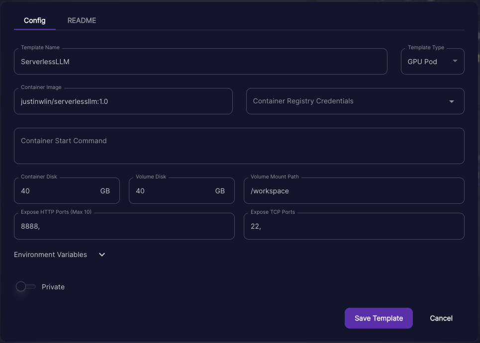
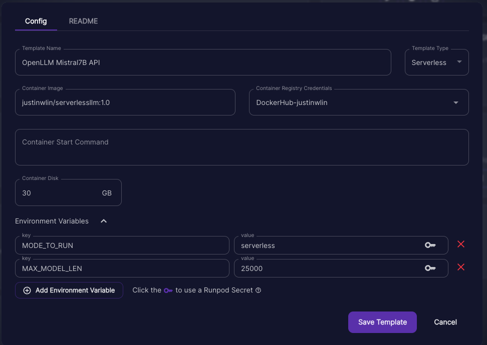

# Docker Configuration for OpenLLM with Runpod

## Summary

This Docker configuration utilizes [OpenLLM](https://github.com/bentoml/OpenLLM) for both GPU and Serverless deployments on Runpod. It employs an environment variable, `MODE_TO_RUN`, to dictate the startup behavior. Depending on the `MODE_TO_RUN` value, the configuration may launch `handler.py` for serverless operations or initiate OpenSSH and Jupyter Lab for GPU pods. This adaptable setup allows for straightforward modifications to meet various deployment requirements.

## CI/CD Pipeline is Setup for what I thought might be Popular Images 
> Note some of these like 70B and Mixtral are inherently super large. So I recommend mistral / llamab13b for serverless, or to look into network volumes yourself if you want to use larger models. But network volumes is not a usecase I am personally interested to test as there is large latency to load such large models from a network volume anyways into VRAM.

> Also, with these base files, it means you can use the Dockerfile_Iteration to just update the handler.py and not have to redownload the model again. You can also modify the Docker_Iteration file to add more dependency and whatever else you want, knowing you have a stable base image to work off of and not have to preload such large models yourself.

**OpenLLM Llama2 70B - GPU Pod and Serverless Ready**

[Runpod](https://runpod.io/gsc?template=iw1bjna1tc&ref=wqryvm1m)

[Dockerhub](https://hub.docker.com/layers/justinwlin/llama2_70b_openllm/latest/images/sha256-c481f8dd51481daf995bfbe7075ee44bf0e1dc680cbda767cc97fcb7fd83f5a4?context=repo)

**OpenLLM Llama2 13b - Pod and Serverless Ready**

[Runpod](https://runpod.io/gsc?template=0dok49hohe&ref=wqryvm1m)

[Dockerhub](https://hub.docker.com/layers/justinwlin/llama2_13b_openllm/latest/images/sha256-35db577b8aea20dde856de69310a44703dbd9473f960cb0c17a71d90c72acb93?context=repo)

**OpenLLM Mixtral 8x7B - Pod and Serverless Ready**

[Runpod](https://runpod.io/gsc?template=od8336xqgo&ref=wqryvm1m)

[Dockerhub](https://hub.docker.com/layers/justinwlin/mixtral_8x7b_openllm/latest/images/sha256-733305b4886892d122da074d25c10b622bf88918e6afea77aefd656a2ea8ef3c?context=repo)


**OpenLLM Mistral 7B - GPU Pod and Serverless Ready**

[Runpod](https://runpod.io/gsc?template=pu8uaqw765&ref=wqryvm1m)

[Dockerhub](https://hub.docker.com/layers/justinwlin/mistral7b_openllm/latest/images/sha256-47f901971ee95cd0d762fe244c4dd625a8bf7a0e0142e5bbd91ee76f61c8b6ef?context=repo)


## Environment Variables

Below is a table of the environment variables that can be passed to the Docker container. These variables enable customization of the deployment's behavior, offering flexibility for different scenarios.

| Variable               | Description                                                                                                                  | Expected Values              | Default Value                   |
|------------------------|------------------------------------------------------------------------------------------------------------------------------|------------------------------|---------------------------------|
| `MODE_TO_RUN`          | Determines the container's operational mode, affecting the execution of `handler.py` and the initiation of services.         | `serverless`, `pod`, `both` | pod                            |
| `MODEL`                | Identifier for the OpenLLM model to be used. Specifies which AI model your applications will utilize during **BUILD STEP OF THE DOCKERFILE**                        | Model Identifier (string)   | mistralai/Mistral-7B-Instruct-v0.1                            |
| `CONCURRENCY_MODIFIER` | A factor used to adjust the concurrency level for handling requests, allowing for tuning based on workload.                  | Integer                     | `1`                             |
| `MAX_MODEL_LEN`        | Sets the maximum sequence length the model can handle, impacting memory usage and processing capabilities.                   | Integer                     | `25000`       |

### Note on Model Identifiers

To find specific model identifiers for use with OpenLLM, visit the [OpenLLM GitHub repository](https://github.com/bentoml/OpenLLM). This resource offers a comprehensive list of available models and their identifiers, which can be utilized to set the `MODEL` environment variable. **THIS VARIABLE IS ONLY USED DURING THE BUILD STEP OF THE DOCKERFILE**. If this changes from the build step, and the handler.py cannot find the model, it will try to download a new model which can slow down your API. So only create this discrepancy if you want to change the model during development on a GPU Pod.

### Note on `MAX_MODEL_LEN`

The `MAX_MODEL_LEN` environment variable defines the maximum number of tokens (sequence length) that the model can process in a single operation. This setting is crucial for managing the balance between performance and the capabilities of the underlying hardware, especially in terms of GPU memory utilization. Adjusting this variable can help avoid errors related to exceeding the maximum Key-Value (KV) cache length. If you encounter an error suggesting that the model's sequence length is larger than the KV cache can support, consider adjusting the `MAX_MODEL_LEN` value downwards.

An ex. error might look like:
```
The model's max seq len (32768) is larger than the maximum number of tokens that can be stored in KV cache (27296). Try increasing `gpu_memory_utilization` or decreasing `max_model_len` when initializing the engine.
```
Or:
```
ValueError: User-specified max_model_len (25000) is greater than the derived max_model_len (None=4096 in model's config.json). This may lead to incorrect model outputs or CUDA errors. Make sure the value is correct and within the model context size.
```

If this is this is the case either adjust the handler.py with a hard-coded value, or set the ENV variable to a lower value. I cannot test every model's max_length so this is something if you see as an error just adjust manually. 

### Mode Descriptions

- `serverless`: Executes `handler.py` for serverless request handling, optimal for scalable, efficient deployments.
- `pod`: Initiates essential services like OpenSSH and Jupyter Lab, bypassing `handler.py`, suitable for development or tasks requiring GPU resources.
- `both`: Combines the functionalities of both modes by executing `handler.py` and initiating essential services, ideal for debugging serverless deployments with additional tool access because you can set a minimum active worker to 1 and then essentially just use Jupyter Notebook / SSH to debug the worker. **(Note: this both behavior might no longer be supported by Runpod b/c they don't let us currently specify HTTP / TCP ports on worker templates anymore.)**

## Getting Started

1. **Build the Docker Image**: Create your image using the Dockerfile, optionally specifying the `MODEL`, `CONCURRENCY_MODIFIER`, and `MAX_MODEL_LEN` variables as needed.

    ```sh
    docker build --build-arg MODEL_ARG=<your_model_identifier> --build-arg MAX_MODEL_LEN=<desired_max_length> -t your_image_name .
    ```

2. **Run the Container**: Start your container with the desired `MODE_TO_RUN`, `MAX_MODEL_LEN`, and any other environment variables.

    ```sh
    docker run -e MODE_TO_RUN=serverless -e CONCURRENCY_MODIFIER=2 -e MAX_MODEL_LEN=25000 your_image_name
    ```

    You can also just leave the Docker run **empty** and let the default run take over. And if you want to instead modify the ENV variables, just use Runpod's GUI where you can write the ENV variables there instead of in the **RUN** command if you are running on runpod. This can be helpful especially if you are for ex. debugging in GPU Pod, and then you want to just deploy on SERVERLESS by just changing the ENV variable when you are making a new template.

3. **Accessing Services**: Depending on the chosen mode,
    - In `serverless` and `both`, interact with the deployed model through the specified handler.
    - In `pod` and `both`, access Jupyter Lab and SSH services as provided.

### Using Depot

For those using Depot to build and deploy containers, the command structure is slightly different. Here's how you can include the environment variables as build arguments with Depot:

```bash
depot build -t yourusername/serverlessllm:1.0 . \
  --build-arg MODE_TO_RUN=pod \
  --build-arg MODEL=mistralai/Mistral-7B-Instruct-v0.1 \
  --build-arg CONCURRENCY_MODIFIER=1 \
  --build-arg MAX_MODEL_LEN=25000 \
  --push --platform linux/amd64
```

### Using Docker CLI
For traditional Docker builds, you can incorporate the environment variables into your build command like so:
```bash
docker build -t yourusername/serverlessllm:1.0 . \
  --build-arg MODE_TO_RUN=pod \
  --build-arg MODEL=mistralai/Mistral-7B-Instruct-v0.1 \
  --build-arg CONCURRENCY_MODIFIER=1 \
  --build-arg MAX_MODEL_LEN=25000
```

## Common Use Case will just be changing out the model
Other variables at least if you are deploying on runpod, the ENV can be changed at runpod. The only thing that really matters at build time is the `MODEL` so it might look closer to like below:
```
depot build -t yourusername/serverlessllm:1.0 . \
  --build-arg MODEL=mistralai/Mistral-7B-Instruct-v0.1 \
  --push --platform linux/amd64
```

# Developer Experience

Start using the container with [GPU_POD](https://runpod.io/gsc?template=pu8uaqw765&ref=wqryvm1m
) (This is my runpod public URL to the template all ready to go for you.)



If you want to deploy on serverless it's super easy! Essentially copy the template but set the environment variable for the MODE to serverless. **Check to make sure the model repository names match up** as I might update template names, or you might be using a different model.:



If you end up wanting to change the handler.py I recommend to build using a flag to target the "Dockerfile_Iteration" after you build using the standard "Dockerfile" once. This way you can have the models cached during the docker build process in the base image and only update the handler.py. This way you can avoid the long wait time to "redownload the model" and just update the handler.py.

```sh
docker build -f Dockerfile_Iteration -t your_image_name .
```

## Overall Methodology:
The methodology is:
1. Build your first Dockerfile where we preload the model + everything the first time
2. Launch a GPU Pod on Runpod and test the handler.py
  -- If everything looks good, just use the same image for serverless and modify the env variable to change how it starts up
  -- If you need to iterate, iterate on Runpod and then copy and paste the handler.py back locally and then build using the Docker_Iteration file, which means you won't have to redownload the whole model again and instead just keep iterating on handler.py
3. Once ready, then relaunch back on GPU Pod and Serverless until ready.

> Note! If the base models are already built for you on my CI/CD pipeline, what that means is that you can just use the Dockerfile_Iteration file, to target that specific repository and just modify the handler.py. This way you can avoid the long wait time to "redownload the model" and just update the handler.py.

# Serverless

## Example Clientside Code

Click here to see the example code I wrote for 'normal' and 'stream' mode. [stream_client_side.py](./stream_client_side.py)

### Notes:
I purposely kept the API very simple. The prompt you can construct however you want, rather than separating out things like system / user prompts. You can just construct the prompt `f"{system_prompt} {user_prompt}"` and then send it to the API. The API will then generate the text based on the prompt and return the text. And if you disagree, you can easily modify the handler.py to act differently of for your use-case, especially if you want to change and add more properties such as temperature etc. But I wanted to keep it as simple as possible at first.

## Expected API Input and Output

### Input Structure

The API expects input provided as a JSON object with the following structure:

```json
{
  "input": {
    "prompt": "<user_prompt>",
    "answerType": "<stream | normal>"
  }
}
```

## Output Structure
> Note you can see more examples on my stream_client_side.py

Stream Mode ("stream"): The API yields multiple JSON objects, each containing a part of the generated text:

```How to call streammode on runpod:```

[Documentation on stream mode invocation:](https://docs.runpod.io/serverless/endpoints/invoke-jobs#stream-results)

```
{"text": "generated text part 1"}
{"text": "generated text part 2"}
...
```

Normal Mode ("normal"): The API returns a single JSON object with the complete generated text:

[Invoking the API with /run](https://docs.runpod.io/serverless/endpoints/invoke-jobs#asynchronous-endpoints)
```json
{
  "text": "generated text"
}
```


## Supported Backends
> The preload.py is specifically looking for backends with 'vllm' which is essentially an optimized version of the model. If you want to use a different backend, you will need to modify the preload function and handler.py as otherwise if not specified it will default to vllm usually. 

Running:
```
openllm models
```

The relevant backends that support vllm you can find if it is said in the supported_backends list.

```
{
  "baichuan": {
    "architecture": "BaichuanForCausalLM",
    "example_id": "baichuan-inc/baichuan2-7b-chat",
    "supported_backends": [
      "pt",
      "vllm"
    ],
    "installation": "pip install \"openllm[baichuan]\"",
    "items": []
  },
  "chatglm": {
    "architecture": "ChatGLMModel",
    "example_id": "thudm/chatglm2-6b-int4",
    "supported_backends": [
      "pt",
      "vllm"
    ],
    "installation": "pip install \"openllm[chatglm]\"",
    "items": []
  },
  "dolly_v2": {
    "architecture": "GPTNeoXForCausalLM",
    "example_id": "databricks/dolly-v2-3b",
    "supported_backends": [
      "pt",
      "vllm",
      "ctranslate"
    ],
    "installation": "pip install openllm",
    "items": []
  },
  "falcon": {
    "architecture": "FalconForCausalLM",
    "example_id": "tiiuae/falcon-40b-instruct",
    "supported_backends": [
      "pt",
      "vllm",
      "ctranslate"
    ],
    "installation": "pip install \"openllm[falcon]\"",
    "items": []
  },
  "flan_t5": {
    "architecture": "T5ForConditionalGeneration",
    "example_id": "google/flan-t5-large",
    "supported_backends": [
      "pt"
    ],
    "installation": "pip install openllm",
    "items": []
  },
  "gpt_neox": {
    "architecture": "GPTNeoXForCausalLM",
    "example_id": "eleutherai/gpt-neox-20b",
    "supported_backends": [
      "pt",
      "vllm",
      "ctranslate"
    ],
    "installation": "pip install openllm",
    "items": []
  },
  "llama": {
    "architecture": "LlamaForCausalLM",
    "example_id": "NousResearch/llama-2-70b-hf",
    "supported_backends": [
      "pt",
      "vllm",
      "ctranslate"
    ],
    "installation": "pip install openllm",
    "items": []
  },
  "mistral": {
    "architecture": "MistralForCausalLM",
    "example_id": "mistralai/Mistral-7B-v0.1",
    "supported_backends": [
      "pt",
      "vllm",
      "ctranslate"
    ],
    "installation": "pip install openllm",
    "items": [
      "vllm-mistralai--mistral-7b-instruct-v0.1:9ab9e76e2b09f9f29ea2d56aa5bd139e4445c59e"
    ]
  },
  "mixtral": {
    "architecture": "MixtralForCausalLM",
    "example_id": "mistralai/Mixtral-8x7B-v0.1",
    "supported_backends": [
      "pt",
      "vllm",
      "ctranslate"
    ],
    "installation": "pip install openllm",
    "items": []
  },
  "mpt": {
    "architecture": "MPTForCausalLM",
    "example_id": "mosaicml/mpt-30b-chat",
    "supported_backends": [
      "pt",
      "vllm",
      "ctranslate"
    ],
    "installation": "pip install \"openllm[mpt]\"",
    "items": []
  },
  "opt": {
    "architecture": "OPTForCausalLM",
    "example_id": "facebook/opt-1.3b",
    "supported_backends": [
      "pt",
      "vllm",
      "ctranslate"
    ],
    "installation": "pip install openllm",
    "items": []
  },
  "phi": {
    "architecture": "PhiForCausalLM",
    "example_id": "microsoft/phi-1_5",
    "supported_backends": [
      "pt",
      "vllm"
    ],
    "installation": "pip install openllm",
    "items": []
  },
  "qwen": {
    "architecture": "QWenLMHeadModel",
    "example_id": "qwen/Qwen-14B-Chat",
    "supported_backends": [
      "pt",
      "vllm"
    ],
    "installation": "pip install \"openllm[qwen]\"",
    "items": []
  },
  "stablelm": {
    "architecture": "GPTNeoXForCausalLM",
    "example_id": "stabilityai/stablelm-base-alpha-3b",
    "supported_backends": [
      "pt",
      "vllm",
      "ctranslate"
    ],
    "installation": "pip install openllm",
    "items": []
  },
  "starcoder": {
    "architecture": "GPTBigCodeForCausalLM",
    "example_id": "bigcode/starcoderbase",
    "supported_backends": [
      "pt",
      "vllm",
      "ctranslate"
    ],
    "installation": "pip install \"openllm[starcoder]\"",
    "items": []
  },
  "yi": {
    "architecture": "YiForCausalLM",
    "example_id": "01-ai/Yi-34B",
    "supported_backends": [
      "pt",
      "vllm"
    ],
    "installation": "pip install openllm",
    "items": []
  }
}
```
